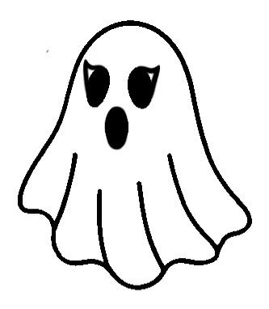

# 🎃 Alterações Realizadas - Hallowen_prototipo

## 📁 Estrutura de Pastas
Todas as imagens foram movidas para a pasta **`assets/`**

### Estrutura atual:
```
Hallowen_prototipo/
├── index.html
├── README.md
├── CHANGES.md (este arquivo)
├── css/
│   └── style.css
├── js/
│   └── script.js
└── assets/
    ├── angella.png
    ├── banner.png
    ├── banner2.webp
    ├── bat.png
    ├── blusa1.png
    ├── cat.png
    ├── concurso1.PNG
    ├── concurso2.PNG
    ├── concurso3.PNG
    ├── ghost.png
    ├── heart.png
    ├── instagram.png
    ├── ModalAbobora.jpg
    ├── ModalCaveira.jpg
    ├── ModalGato.jpg
    ├── moldalFantasma.jpg
    ├── openbar.png
    ├── pumpkin.png
    ├── skull.png
    ├── spider.png
    └── transition.png
```

## 🔄 Funcionalidade do Carrossel

### ✨ Novas Funções Adicionadas:
- `openTattooModal(index)` - Abre o modal com a tatuagem no índice especificado
- `updateTattooModal()` - Atualiza o conteúdo do modal com a tatuagem atual
- `nextTattoo()` - Navega para a próxima tatuagem
- `previousTattoo()` - Navega para a tatuagem anterior

### 🎮 Controles de Navegação:
1. **Clique nas miniaturas** - Abre o modal com a tatuagem selecionada
2. **Botões de Seta (← →)** - Navega entre as tatuagens no modal
3. **Teclas de Seta do Teclado** - 
   - **← Seta para Esquerda** - Tatuagem anterior
   - **→ Seta para Direita** - Próxima tatuagem
   - **Esc** - Fecha o modal
4. **Clique no ×** - Fecha o modal

### 📋 Tatuagens Disponíveis:
1. 👻 **Fantasma Assustador** → `assets/moldalFantasma.jpg`
2. 💀 **Caveira Sombria** → `assets/ModalCaveira.jpg`
3. 🦇 **Morcego Noturno** → `assets/bat.png`
4. 🎃 **Jack O'Lantern** → `assets/ModalAbobora.jpg`
5. 🕷️ **Aranha Macabra** → `assets/ModalGato.jpg`
6. 😈 **Coração Diabólico** → `assets/heart.png`

## 🛠️ Arquivos Modificados

### `index.html`
- ✅ Todos os caminhos de imagens atualizados para `assets/`
- ✅ Botões de navegação do modal alterados para usar `nextTattoo()` e `previousTattoo()`

### `js/script.js`
- ✅ Arrays `galleryImages` e `tattooDesigns` agora usam `assets/` como prefixo
- ✅ Adicionada variável global `currentTattooIndex` para rastrear a tatuagem ativa
- ✅ Funções `nextTattoo()` e `previousTattoo()` implementadas
- ✅ Função `updateTattooModal()` criada para gerenciar atualizações do modal
- ✅ Navegação por teclado atualizada para setas de tatuagem
- ✅ Funções expostas globalmente: `window.openTattooModal`, `window.nextTattoo`, `window.previousTattoo`

### `css/style.css`
- ✅ Estilos do modal corrigidos (conflito de `display` resolvido)
- ✅ Estilos de navegação responsivos
- ✅ Sem mudanças estruturais necessárias

## 🎯 Como Usar

### Abrir uma tatuagem específica via HTML:
```html

```

### Navegar programaticamente via JavaScript:
```javascript
nextTattoo();      // Próxima tatuagem
previousTattoo();  // Tatuagem anterior
openTattooModal(2); // Abre tatuagem no índice 2
```

## 📱 Responsividade
- ✅ Modal funciona em desktop e mobile
- ✅ Botões de navegação adaptados ao tamanho da tela
- ✅ Imagens escalam corretamente

## ✨ Melhorias Futuras
- Adicionar indicador de página atual (ex: "2/6")
- Precarregar próxima/anterior imagem para transição mais suave
- Adicionar swipe em mobile para navegação
- Adicionar efeito de transição ao trocar imagens

---

**Data da Atualização:** 20 de Outubro de 2025  
**Versão:** 2.0  
**Status:** ✅ Funcionando corretamente
